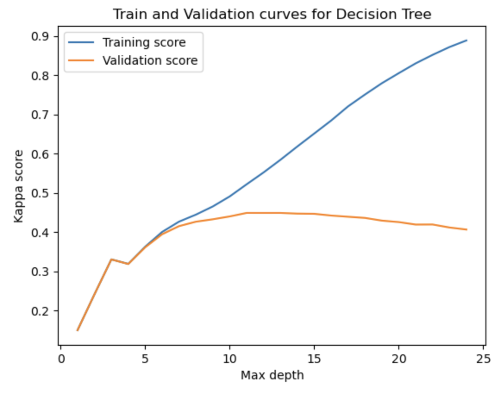
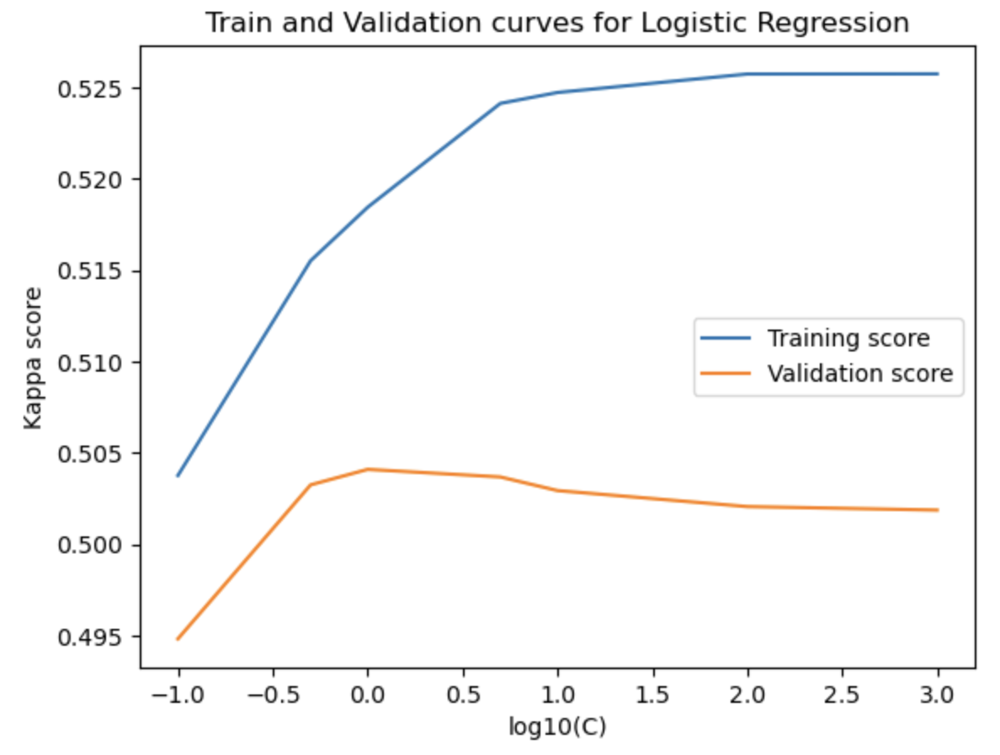
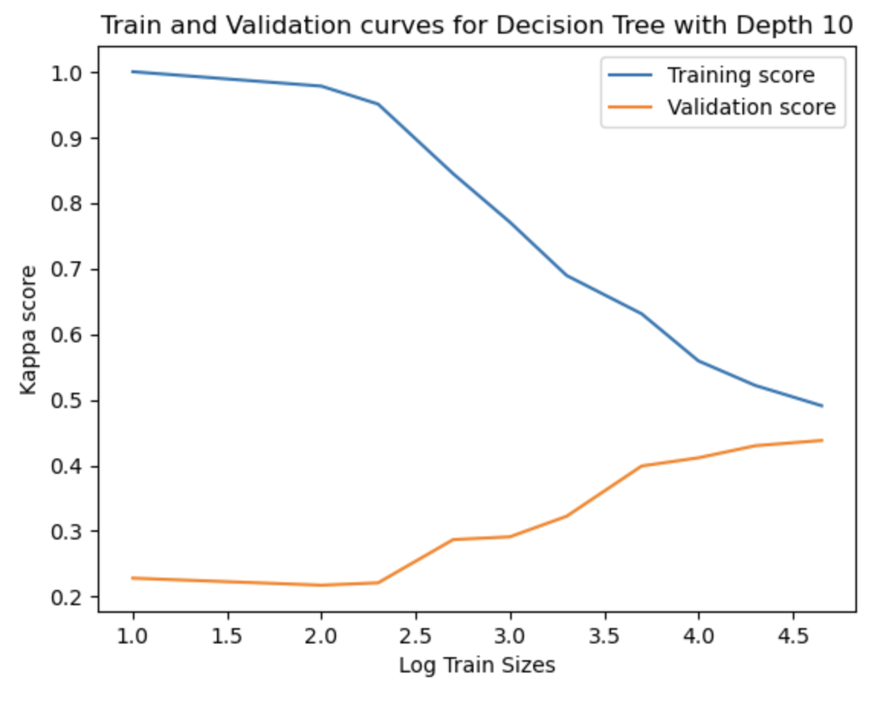
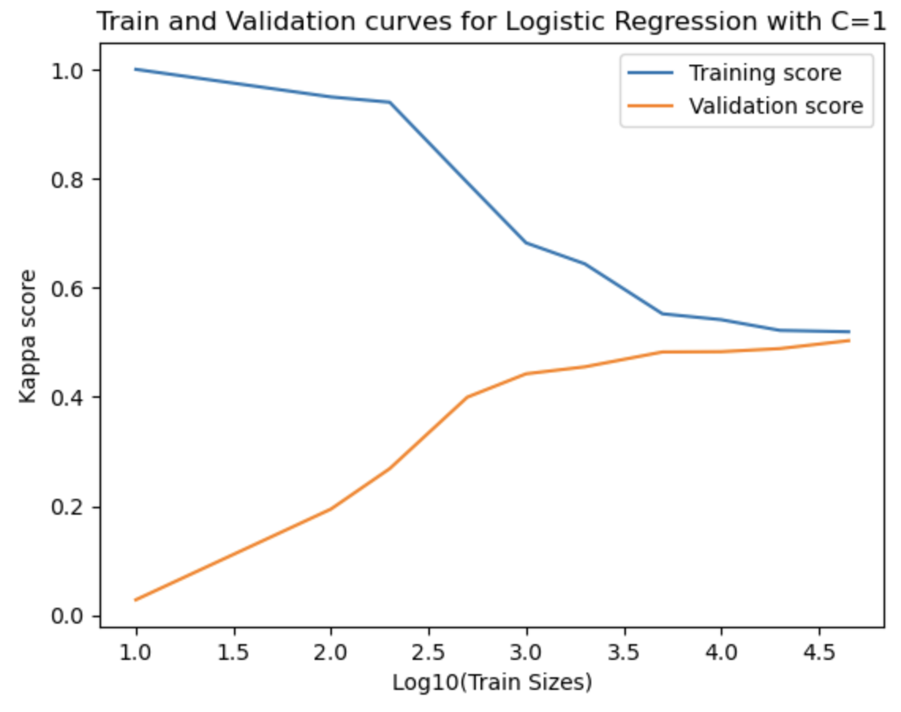

# Decision Tree vs Logistic Regression

Credits: https://www.kaggle.com/competitions/prudential-life-insurance-assessment

Following are the graphs generated:

For the graph below, beyond a certain point (depth=10), the model starts overfitting the training dataset. Hence, the kappa scores of training examples keep on increasing while the kappa scores of test examples starts decreasing

Here, as the number of training examples increases, the overfitting starts decreasing and we get much better datapoints for kappa score for training and test datasets

Here, post the value of C=1, the model starts overfitting the training dataset

Here also, we observe something similar to what we observed for the decision tree

Since the kappa score is better for logistic regression (0.5), we can say that for this dataset, logistic regression performs a better job compared to decision tree.